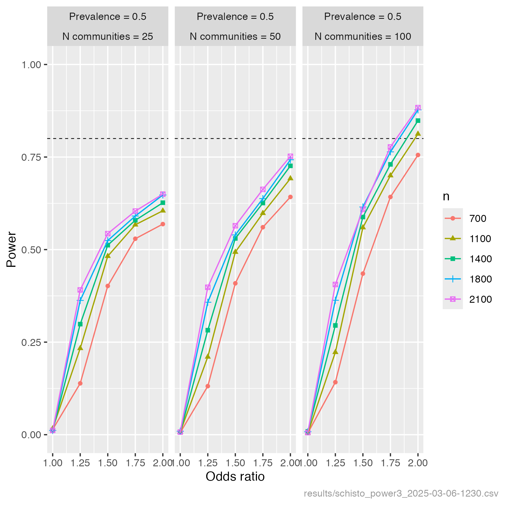
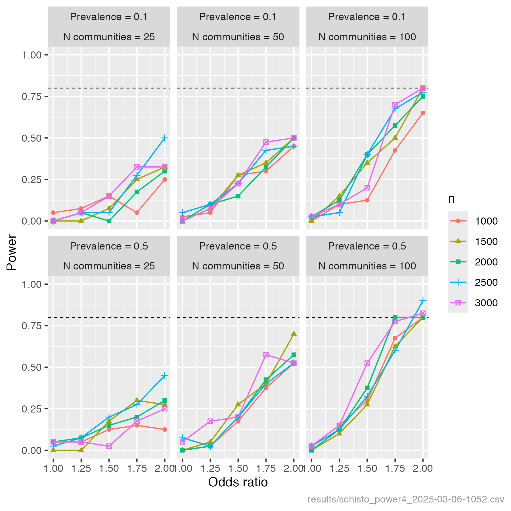
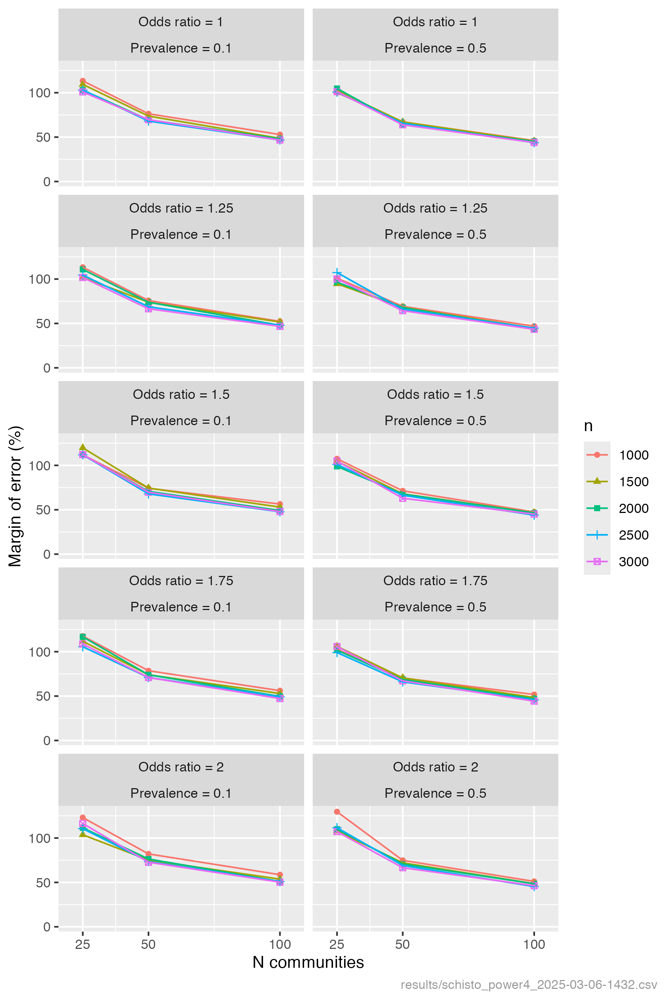
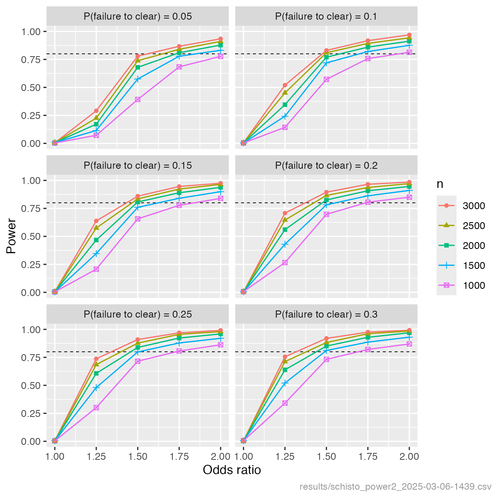
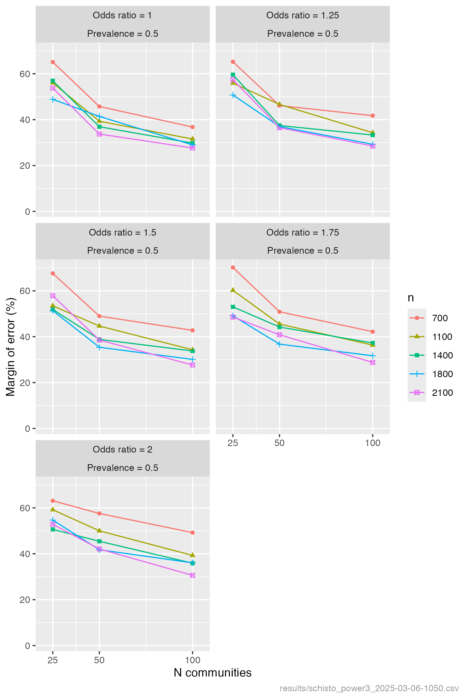

# SchistoDrivers

 ## Sample size calculation 1: randomised controlled trial for the effect of food prior to treatment on praziquantel absorption (Rapid Answer Project 1) 

 ### Methods

 The aim of this power analysis is to estimate power to detect a difference in praziquantel absorption (measured as area under the curve [AUC] of praziquantel metabolites) between three groups:
 - people who have taken food at home prior to praziquantel treatment;
 - people who have brought in food to be taken prior to praziquantel treatment;
 - people for whom food has been provided on site prior to praziquantel treatment.

 The null hypothesis is that mean AUC is equal across the three groups. The alternative hypothesis is that mean AUC differs between the three groups. The effect size assumed here is that the group AUC means differ by 0.25 standard deviations from the lowest mean to the intermediate mean, and by 0.25 standard deviations from the intermediate mean to the highest mean. Target power is 90%, which is set higher that the standard minimal threshold of 80%. Lowering the risk of a type II error in this way is justified by the likely public health benefit of finding an optimal strategy, if it exists, for taking food prior to praziquantel treatment. The null hypothesis is rejected if P < 0.05 from a one-way ANOVA. The required sample size per group was calculated using the R function *power.anova.test*. Full details are provided in the script [PowerAnalysis.R](https://github.com/pcdjohnson/SchistoDrivers/blob/main/PowerAnalysis.R). 

 ### Results
 103 people would be required per group in order to achieve 90% power to detect a 0.25 standard deviation difference between each of the three groups. For context, we note that [Kovač et al. (2018)](https://doi.org/10.1128/aac.02253-17) detected significant differences between groups of children treated with different praziquantel doses in both metabolite AUC and schistosome clearance rate with per-group sample sizes ranging from 29 to 47. Therefore we expect that 103 per group will give high sensitivity to detect the effects of different strategies for eating prior to treatment. 

## Sample size calculation 2: Miracidial trial to enable time and money saving mass storage in the field (Rapid Answer Project 2) 

 The aim of this power analysis is to estimate the power to detect hybrid or resistant haplotypes present at at least 5% frequency in a population of miracidia. Assuming complete admixture within each community, by sampling 28 miracidia  (56 haplotypes) we have a 94.3% chance of observing hybrid or resistant haplotypes present at 5% frequency in the population. See the script [PowerAnalysis.R](https://github.com/pcdjohnson/SchistoDrivers/blob/main/PowerAnalysis.R) for details. 

## Sample size calculation 3: identifying drivers of schistosomiasis praziquantel treatment failure (main study)

 ### Methods

 The aim of this power analysis is to estimate power to detect drivers of praziquantel treatment failure in individuals infected with schistosomiasis. This is a simulation-based power analysis, where the study data is simulated and analysed multiple times under varying study design scenarios, and power is estimated as the proportion of simulated analyses that achieve the desired outcome (detecting a true driver of treatment failure). The association between the outcome (treatment failure) and each driver is estimated and tested in a multivariable GLM. For this analysis, power is defined as the proportion of drivers that are significantly associated with the outcome, averaged across 1000 simulated data analyses per scenario.

 The following assumptions are made:
- 10 drivers are associated with the outcome, of which 3 are binary and 7 continuous. The prevalences of the binary drivers are: 0.5, 0.2, 0.2, representing  malaria, soil-transmitted helminths, hybrid/resistance presence .
 - The drivers are correlated with each other, with a common correlation coefficient of 0.25. We don’t know what the true correlation is among drivers, but moderate correlations are likely and neglecting them will give optimistic power estimates.
 - In order to control inflation of the number of false positive results due to multiple testing of 10 drivers, the significance threshold of 0.05 is Bonferroni-adjusted to 0.005, i.e. a driver is significant if P < 0.005.

 We explore the effect on power of varying the following study design choices/assumptions:
 - Sample size (number of infected and treated individuals): 1000, 1500, 2000, 2500, 3000.
 - The proportion of these that fail to clear: 0.05, 0.1, 0.15, 0.2, 0.25, 0.3.
 - The strength of association between each driver and failure to clear, defined as an odds ratio for binary drivers and as an odds ratio per standard deviation unit for continuous drivers: 1.25, 1.5, 1.75, 2. To give a sense of what these effect sizes mean:
   - If a binary driver has an odds ratio of 1.5, then if 5% of people fail to clear in the absence of a driver, that proportion will be 7.3% among those who are exposed to the driver. If the prevalence of failure to clear is 25% without the driver, it will be 33% with the driver.
   - If we raise the odds ratio from 1.5 to 2, then the prevalences of failure to clear in the exposed population will be 9.5% relative to 5% in the unexposed population, and 40% relative to 25% in the unexposed population.

 Full details are provided in the script [PowerAnalysis.R](https://github.com/pcdjohnson/SchistoDrivers/blob/main/PowerAnalysis.R). Results are output as CSV to the [results](https://github.com/pcdjohnson/SchistoDrivers/tree/main/results) directory and plotted to [schisto_power3.png](https://github.com/pcdjohnson/SchistoDrivers/blob/main/schisto_power3.png).

 ### Results
  

## Sample size calculation 4: identifying community-level drivers of schistosomiasis infection

 ### Methods

 The aim of this power analysis is to estimate power to detect community-level drivers of schistosomiasis infection, and the expected margin of error around community-level driver odds ratio estimates. This is a simulation-based power analysis, where the study data is simulated and analysed multiple times under varying study design scenarios, and power is estimated as the proportion of simulated analyses that achieve the desired outcome (detecting a true driver of infection). The association between the outcome (infection) and each driver is estimated and tested in a multivariable GLMM. For this analysis, power is defined as the proportion of drivers that are significantly associated with the outcome, averaged across 500 simulated data analyses per scenario.

 The following assumptions are made:
- 4 continuous drivers are associated with the outcome.
 - The drivers are correlated with each other, with a common correlation coefficient of 0.25. We don’t know what the true correlation is among drivers, but moderate correlations are likely and neglecting them will give optimistic power estimates.
 - Log odds of infection prevalence varies among communities with a variance of 2.73.
 - In order to control inflation of the number of false positive results due to multiple testing of 4 drivers, the significance threshold of 0.05 is Bonferroni-adjusted to 0.0125, i.e. a driver is significant if P < 0.0125.

 We explore the effect on power of varying the following study design choices/assumptions:
 - Total sample size: 1000, 1500, 2000, 2500, 3000.
 - Community sample size (number communities sampled): 25, 50, 100.
 - Prevalence of infection: 0.1, 0.5.
 - The strength of association between each driver and failure to clear, defined as an odds ratio per standard deviation unit for continuous community-level drivers: 1.25, 1.5, 1.75, 2.

 Full details are provided in the script [PowerAnalysis.R](https://github.com/pcdjohnson/SchistoDrivers/blob/main/PowerAnalysis.R). Results are output as CSV to the [results](https://github.com/pcdjohnson/SchistoDrivers/tree/main/results) directory and plotted to [schisto_power4.png](https://github.com/pcdjohnson/SchistoDrivers/blob/main/schisto_power4.png) and [schisto_moe4.png](https://github.com/pcdjohnson/SchistoDrivers/blob/main/schisto_moe4.png).

 ### Results
  

  

## Sample size calculation 4: identifying community-level drivers of schistosomiasis infection

 ### Methods

 The aim of this power analysis is to estimate power to detect community-level drivers of schistosomiasis infection, and the expected margin of error around community-level driver odds ratio estimates. This is a simulation-based power analysis, where the study data is simulated and analysed multiple times under varying study design scenarios, and power is estimated as the proportion of simulated analyses that achieve the desired outcome (detecting a true driver of infection). The association between the outcome (infection) and each driver is estimated and tested in a multivariable GLMM. For this analysis, power is defined as the proportion of drivers that are significantly associated with the outcome, averaged across 500 simulated data analyses per scenario.

 The following assumptions are made:
- 4 continuous drivers are associated with the outcome.
 - The drivers are correlated with each other, with a common correlation coefficient of 0.25. We don’t know what the true correlation is among drivers, but moderate correlations are likely and neglecting them will give optimistic power estimates.
 - Log odds of infection prevalence varies among communities with a variance of 2.73.
 - In order to control inflation of the number of false positive results due to multiple testing of 4 drivers, the significance threshold of 0.05 is Bonferroni-adjusted to 0.0125, i.e. a driver is significant if P < 0.0125.

 We explore the effect on power of varying the following study design choices/assumptions:
 - Total sample size: 1000, 1500, 2000, 2500, 3000.
 - Community sample size (number communities sampled): 25, 50, 100.
 - Prevalence of infection: 0.1, 0.5.
 - The strength of association between each driver and failure to clear, defined as an odds ratio per standard deviation unit for continuous community-level drivers: 1.25, 1.5, 1.75, 2.

 Full details are provided in the script [PowerAnalysis.R](https://github.com/pcdjohnson/SchistoDrivers/blob/main/PowerAnalysis.R). Results are output as CSV to the [results](https://github.com/pcdjohnson/SchistoDrivers/tree/main/results) directory and plotted to [schisto_power4.png](https://github.com/pcdjohnson/SchistoDrivers/blob/main/schisto_power4.png) and [schisto_moe4.png](https://github.com/pcdjohnson/SchistoDrivers/blob/main/schisto_moe4.png).

 ### Results
  

  

## Sample size calculation 3: identifying drivers of schistosomiasis praziquantel treatment failure (main study)

 ### Methods

 The aim of this power analysis is to estimate power to detect drivers of praziquantel treatment failure in individuals infected with schistosomiasis. This is a simulation-based power analysis, where the study data is simulated and analysed multiple times under varying study design scenarios, and power is estimated as the proportion of simulated analyses that achieve the desired outcome (detecting a true driver of treatment failure). The association between the outcome (treatment failure) and each driver is estimated and tested in a multivariable GLM. For this analysis, power is defined as the proportion of drivers that are significantly associated with the outcome, averaged across 10 simulated data analyses per scenario.

 The following assumptions are made:
- 10 drivers are associated with the outcome, of which 3 are binary and 7 continuous. The prevalences of the binary drivers are: 0.5, 0.2, 0.2, representing  malaria, soil-transmitted helminths, hybrid/resistance presence .
 - The drivers are correlated with each other, with a common correlation coefficient of 0.25. We don’t know what the true correlation is among drivers, but moderate correlations are likely and neglecting them will give optimistic power estimates.
 - In order to control inflation of the number of false positive results due to multiple testing of 10 drivers, the significance threshold of 0.05 is Bonferroni-adjusted to 0.005, i.e. a driver is significant if P < 0.005.

 We explore the effect on power of varying the following study design choices/assumptions:
 - Sample size (number of infected and treated individuals): 1000, 1500, 2000, 2500, 3000.
 - The proportion of these that fail to clear: 0.05, 0.1, 0.15, 0.2, 0.25, 0.3.
 - The strength of association between each driver and failure to clear, defined as an odds ratio for binary drivers and as an odds ratio per standard deviation unit for continuous drivers: 1.25, 1.5, 1.75, 2. To give a sense of what these effect sizes mean:
   - If a binary driver has an odds ratio of 1.5, then if 5% of people fail to clear in the absence of a driver, that proportion will be 7.3% among those who are exposed to the driver. If the prevalence of failure to clear is 25% without the driver, it will be 33% with the driver.
   - If we raise the odds ratio from 1.5 to 2, then the prevalences of failure to clear in the exposed population will be 9.5% relative to 5% in the unexposed population, and 40% relative to 25% in the unexposed population.

 Full details are provided in the script [PowerAnalysis.R](https://github.com/pcdjohnson/SchistoDrivers/blob/main/PowerAnalysis.R). Results are output as CSV to the [results](https://github.com/pcdjohnson/SchistoDrivers/tree/main/results) directory and plotted to [schisto_power3.png](https://github.com/pcdjohnson/SchistoDrivers/blob/main/schisto_power3.png).

 ### Results
  

## Sample size calculation 4: identifying community-level drivers of schistosomiasis infection

 ### Methods

 The aim of this power analysis is to estimate power to detect community-level drivers of schistosomiasis infection, and the expected margin of error around community-level driver odds ratio estimates. This is a simulation-based power analysis, where the study data is simulated and analysed multiple times under varying study design scenarios, and power is estimated as the proportion of simulated analyses that achieve the desired outcome (detecting a true driver of infection). The association between the outcome (infection) and each driver is estimated and tested in a multivariable GLMM. For this analysis, power is defined as the proportion of drivers that are significantly associated with the outcome, averaged across 5 simulated data analyses per scenario.

 The following assumptions are made:
- 4 continuous drivers are associated with the outcome.
 - The drivers are correlated with each other, with a common correlation coefficient of 0.25. We don’t know what the true correlation is among drivers, but moderate correlations are likely and neglecting them will give optimistic power estimates.
 - Log odds of infection prevalence varies among communities with a variance of 2.73.
 - In order to control inflation of the number of false positive results due to multiple testing of 4 drivers, the significance threshold of 0.05 is Bonferroni-adjusted to 0.0125, i.e. a driver is significant if P < 0.0125.

 We explore the effect on power of varying the following study design choices/assumptions:
 - Total sample size: 1000, 1500, 2000, 2500, 3000.
 - Community sample size (number communities sampled): 25, 50, 100.
 - Prevalence of infection: 0.1, 0.5.
 - The strength of association between each driver and failure to clear, defined as an odds ratio per standard deviation unit for continuous community-level drivers: 1.25, 1.5, 1.75, 2.

 Full details are provided in the script [PowerAnalysis.R](https://github.com/pcdjohnson/SchistoDrivers/blob/main/PowerAnalysis.R). Results are output as CSV to the [results](https://github.com/pcdjohnson/SchistoDrivers/tree/main/results) directory and plotted to [schisto_power4.png](https://github.com/pcdjohnson/SchistoDrivers/blob/main/schisto_power4.png) and [schisto_moe4.png](https://github.com/pcdjohnson/SchistoDrivers/blob/main/schisto_moe4.png).

 ### Results
  

  

## Sample size for Aim 2: identifying drivers of schistosomiasis praziquantel treatment failure

 ### Methods

 The aim of this power analysis is to estimate power to detect drivers of praziquantel treatment failure in individuals infected with schistosomiasis. This is a simulation-based power analysis, where the study data is simulated and analysed multiple times under varying study design scenarios, and power is estimated as the proportion of simulated analyses that achieve the desired outcome (detecting a true driver of treatment failure). The association between the outcome (treatment failure) and each driver is estimated and tested in a multivariable GLM. For this analysis, power is defined as the proportion of drivers that are significantly associated with the outcome, averaged across 1000 simulated data analyses per scenario.

 The following assumptions are made:
- 10 drivers are associated with the outcome, of which 3 are binary and 7 continuous. The prevalences of the binary drivers are: 0.5, 0.2, 0.2, representing  malaria, soil-transmitted helminths, hybrid/resistance presence .
 - The drivers are correlated with each other, with a common correlation coefficient of 0.25. We don’t know what the true correlation is among drivers, but moderate correlations are likely and neglecting them will give optimistic power estimates.
 - In order to control inflation of the number of false positive results due to multiple testing of 10 drivers, the significance threshold of 0.05 is Bonferroni-adjusted to 0.005, i.e. a driver is significant if P < 0.005.

 We explore the effect on power of varying the following study design choices/assumptions:
 - Sample size (number of infected and treated individuals): 1000, 1500, 2000, 2500, 3000.
 - The proportion of these that fail to clear: 0.05, 0.1, 0.15, 0.2, 0.25, 0.3.
 - The strength of association between each driver and failure to clear, defined as an odds ratio for binary drivers and as an odds ratio per standard deviation unit for continuous drivers: 1.25, 1.5, 1.75, 2. To give a sense of what these effect sizes mean:
   - If a binary driver has an odds ratio of 1.5, then if 5% of people fail to clear in the absence of a driver, that proportion will be 7.3% among those who are exposed to the driver. If the prevalence of failure to clear is 25% without the driver, it will be 33% with the driver.
   - If we raise the odds ratio from 1.5 to 2, then the prevalences of failure to clear in the exposed population will be 9.5% relative to 5% in the unexposed population, and 40% relative to 25% in the unexposed population.

 Full details are provided in the script [PowerAnalysis.R](https://github.com/pcdjohnson/SchistoDrivers/blob/main/PowerAnalysis.R). Results are output as CSV to the [results](https://github.com/pcdjohnson/SchistoDrivers/tree/main/results) directory and plotted to [schisto_power2.png](https://github.com/pcdjohnson/SchistoDrivers/blob/main/schisto_power2.png).

 ### Results
  

## Sample size for Aim 2: identifying drivers of schistosomiasis praziquantel treatment failure

 ### Methods

 The aim of this power analysis is to estimate power to detect drivers of praziquantel treatment failure in individuals infected with schistosomiasis. This is a simulation-based power analysis, where the study data is simulated and analysed multiple times under varying study design scenarios, and power is estimated as the proportion of simulated analyses that achieve the desired outcome (detecting a true driver of treatment failure). The association between the outcome (treatment failure) and each driver is estimated and tested in a multivariable GLM. For this analysis, power is defined as the proportion of drivers that are significantly associated with the outcome, averaged across 10 simulated data analyses per scenario.

 The following assumptions are made:
- 10 drivers are associated with the outcome, of which 3 are binary and 7 continuous. The prevalences of the binary drivers are: 0.5, 0.2, 0.2, representing  malaria, soil-transmitted helminths, hybrid/resistance presence .
 - The drivers are correlated with each other, with a common correlation coefficient of 0.25. We don’t know what the true correlation is among drivers, but moderate correlations are likely and neglecting them will give optimistic power estimates.
 - In order to control inflation of the number of false positive results due to multiple testing of 10 drivers, the significance threshold of 0.05 is Bonferroni-adjusted to 0.005, i.e. a driver is significant if P < 0.005.

 We explore the effect on power of varying the following study design choices/assumptions:
 - Sample size (number of infected and treated individuals): 1000, 1500, 2000, 2500, 3000.
 - The proportion of these that fail to clear: 0.05, 0.1, 0.15, 0.2, 0.25, 0.3.
 - The strength of association between each driver and failure to clear, defined as an odds ratio for binary drivers and as an odds ratio per standard deviation unit for continuous drivers: 1.25, 1.5, 1.75, 2. To give a sense of what these effect sizes mean:
   - If a binary driver has an odds ratio of 1.5, then if 5% of people fail to clear in the absence of a driver, that proportion will be 7.3% among those who are exposed to the driver. If the prevalence of failure to clear is 25% without the driver, it will be 33% with the driver.
   - If we raise the odds ratio from 1.5 to 2, then the prevalences of failure to clear in the exposed population will be 9.5% relative to 5% in the unexposed population, and 40% relative to 25% in the unexposed population.

 Full details are provided in the script [PowerAnalysis.R](https://github.com/pcdjohnson/SchistoDrivers/blob/main/PowerAnalysis.R). Results are output as CSV to the [results](https://github.com/pcdjohnson/SchistoDrivers/tree/main/results) directory and plotted to [schisto_power2.png](https://github.com/pcdjohnson/SchistoDrivers/blob/main/schisto_power2.png).

 ### Results
  

## Sample size for Aim 2: identifying drivers of schistosomiasis praziquantel treatment failure

 ### Methods

 The aim of this power analysis is to estimate power to detect drivers of praziquantel treatment failure in individuals infected with schistosomiasis. This is a simulation-based power analysis, where the study data is simulated and analysed multiple times under varying study design scenarios, and power is estimated as the proportion of simulated analyses that achieve the desired outcome (detecting a true driver of treatment failure). The association between the outcome (treatment failure) and each driver is estimated and tested in a multivariable GLM. For this analysis, power is defined as the proportion of drivers that are significantly associated with the outcome, averaged across 10 simulated data analyses per scenario.

 The following assumptions are made:
- 10 drivers are associated with the outcome, of which 3 are binary and 7 continuous. The prevalences of the binary drivers are: 0.5, 0.2, 0.2, representing  malaria, soil-transmitted helminths, hybrid/resistance presence .
 - The drivers are correlated with each other, with a common correlation coefficient of 0.25. We don’t know what the true correlation is among drivers, but moderate correlations are likely and neglecting them will give optimistic power estimates.
 - In order to control inflation of the number of false positive results due to multiple testing of 10 drivers, the significance threshold of 0.05 is Bonferroni-adjusted to 0.005, i.e. a driver is significant if P < 0.005.

 We explore the effect on power of varying the following study design choices/assumptions:
 - Sample size (number of infected and treated individuals): 1000, 1500, 2000, 2500, 3000.
 - The proportion of these that fail to clear: 0.05, 0.1, 0.15, 0.2, 0.25, 0.3.
 - The strength of association between each driver and failure to clear, defined as an odds ratio for binary drivers and as an odds ratio per standard deviation unit for continuous drivers: 1.25, 1.5, 1.75, 2. To give a sense of what these effect sizes mean:
   - If a binary driver has an odds ratio of 1.5, then if 5% of people fail to clear in the absence of a driver, that proportion will be 7.3% among those who are exposed to the driver. If the prevalence of failure to clear is 25% without the driver, it will be 33% with the driver.
   - If we raise the odds ratio from 1.5 to 2, then the prevalences of failure to clear in the exposed population will be 9.5% relative to 5% in the unexposed population, and 40% relative to 25% in the unexposed population.

 Full details are provided in the script [PowerAnalysis.R](https://github.com/pcdjohnson/SchistoDrivers/blob/main/PowerAnalysis.R). Results are output as CSV to the [results](https://github.com/pcdjohnson/SchistoDrivers/tree/main/results) directory and plotted to [schisto_power2.png](https://github.com/pcdjohnson/SchistoDrivers/blob/main/schisto_power2.png).

 ### Results
  

## Sample size for Aim 2: identifying drivers of schistosomiasis praziquantel treatment failure

 ### Methods

 The aim of this power analysis is to estimate power to detect drivers of praziquantel treatment failure in individuals infected with schistosomiasis. This is a simulation-based power analysis, where the study data is simulated and analysed multiple times under varying study design scenarios, and power is estimated as the proportion of simulated analyses that achieve the desired outcome (detecting a true driver of treatment failure). The association between the outcome (treatment failure) and each driver is estimated and tested in a multivariable GLM. For this analysis, power is defined as the proportion of drivers that are significantly associated with the outcome, averaged across 10 simulated data analyses per scenario.

 The following assumptions are made:
- 10 drivers are associated with the outcome, of which 3 are binary and 7 continuous. The prevalences of the binary drivers are: 0.5, 0.2, 0.2, representing  malaria, soil-transmitted helminths, hybrid/resistance presence .
 - The drivers are correlated with each other, with a common correlation coefficient of 0.25. We don’t know what the true correlation is among drivers, but moderate correlations are likely and neglecting them will give optimistic power estimates.
 - In order to control inflation of the number of false positive results due to multiple testing of 10 drivers, the significance threshold of 0.05 is Bonferroni-adjusted to 0.005, i.e. a driver is significant if P < 0.005.

 We explore the effect on power of varying the following study design choices/assumptions:
 - Sample size (number of infected and treated individuals): 1000, 1500, 2000, 2500, 3000.
 - The proportion of these that fail to clear: 0.05, 0.1, 0.15, 0.2, 0.25, 0.3.
 - The strength of association between each driver and failure to clear, defined as an odds ratio for binary drivers and as an odds ratio per standard deviation unit for continuous drivers: 1.25, 1.5, 1.75, 2. To give a sense of what these effect sizes mean:
   - If a binary driver has an odds ratio of 1.5, then if 5% of people fail to clear in the absence of a driver, that proportion will be 7.3% among those who are exposed to the driver. If the prevalence of failure to clear is 25% without the driver, it will be 33% with the driver.
   - If we raise the odds ratio from 1.5 to 2, then the prevalences of failure to clear in the exposed population will be 9.5% relative to 5% in the unexposed population, and 40% relative to 25% in the unexposed population.

 Full details are provided in the script [PowerAnalysis.R](https://github.com/pcdjohnson/SchistoDrivers/blob/main/PowerAnalysis.R). Results are output as CSV to the [results](https://github.com/pcdjohnson/SchistoDrivers/tree/main/results) directory and plotted to [schisto_power2.png](https://github.com/pcdjohnson/SchistoDrivers/blob/main/schisto_power2.png).

 ### Results
  

## Sample size for Aim 2: identifying drivers of schistosomiasis praziquantel treatment failure

 ### Methods

 The aim of this power analysis is to estimate power to detect drivers of praziquantel treatment failure in individuals infected with schistosomiasis. This is a simulation-based power analysis, where the study data is simulated and analysed multiple times under varying study design scenarios, and power is estimated as the proportion of simulated analyses that achieve the desired outcome (detecting a true driver of treatment failure). The association between the outcome (treatment failure) and each driver is estimated and tested in a multivariable GLM. For this analysis, power is defined as the proportion of drivers that are significantly associated with the outcome, averaged across 10 simulated data analyses per scenario.

 The following assumptions are made:
- 10 drivers are associated with the outcome, of which 3 are binary and 7 continuous. The prevalences of the binary drivers are: 0.5, 0.2, 0.2, representing  malaria, soil-transmitted helminths, hybrid/resistance presence .
 - The drivers are correlated with each other, with a common correlation coefficient of 0.25. We don’t know what the true correlation is among drivers, but moderate correlations are likely and neglecting them will give optimistic power estimates.
 - In order to control inflation of the number of false positive results due to multiple testing of 10 drivers, the significance threshold of 0.05 is Bonferroni-adjusted to 0.005, i.e. a driver is significant if P < 0.005.

 We explore the effect on power of varying the following study design choices/assumptions:
 - Sample size (number of infected and treated individuals): 1000, 1500, 2000, 2500, 3000.
 - The proportion of these that fail to clear: 0.05, 0.1, 0.15, 0.2, 0.25, 0.3.
 - The strength of association between each driver and failure to clear, defined as an odds ratio for binary drivers and as an odds ratio per standard deviation unit for continuous drivers: 1.25, 1.5, 1.75, 2. To give a sense of what these effect sizes mean:
   - If a binary driver has an odds ratio of 1.5, then if 5% of people fail to clear in the absence of a driver, that proportion will be 7.3% among those who are exposed to the driver. If the prevalence of failure to clear is 25% without the driver, it will be 33% with the driver.
   - If we raise the odds ratio from 1.5 to 2, then the prevalences of failure to clear in the exposed population will be 9.5% relative to 5% in the unexposed population, and 40% relative to 25% in the unexposed population.

 Full details are provided in the script [PowerAnalysis.R](https://github.com/pcdjohnson/SchistoDrivers/blob/main/PowerAnalysis.R). Results are output as CSV to the [results](https://github.com/pcdjohnson/SchistoDrivers/tree/main/results) directory and plotted to [schisto_power2.png](https://github.com/pcdjohnson/SchistoDrivers/blob/main/schisto_power2.png).

 ### Results
  

## Sample size for Aim 2: identifying drivers of schistosomiasis praziquantel treatment failure

 ### Methods

 The aim of this power analysis is to estimate power to detect drivers of praziquantel treatment failure in individuals infected with schistosomiasis. This is a simulation-based power analysis, where the study data is simulated and analysed multiple times under varying study design scenarios, and power is estimated as the proportion of simulated analyses that achieve the desired outcome (detecting a true driver of treatment failure). The association between the outcome (treatment failure) and each driver is estimated and tested in a multivariable GLM. For this analysis, power is defined as the proportion of drivers that are significantly associated with the outcome, averaged across 10 simulated data analyses per scenario.

 The following assumptions are made:
- 10 drivers are associated with the outcome, of which 3 are binary and 7 continuous. The prevalences of the binary drivers are: 0.5, 0.2, 0.2, representing  malaria, soil-transmitted helminths, hybrid/resistance presence .
 - The drivers are correlated with each other, with a common correlation coefficient of 0.25. We don’t know what the true correlation is among drivers, but moderate correlations are likely and neglecting them will give optimistic power estimates.
 - In order to control inflation of the number of false positive results due to multiple testing of 10 drivers, the significance threshold of 0.05 is Bonferroni-adjusted to 0.005, i.e. a driver is significant if P < 0.005.

 We explore the effect on power of varying the following study design choices/assumptions:
 - Sample size (number of infected and treated individuals): 1000, 1500, 2000, 2500, 3000.
 - The proportion of these that fail to clear: 0.05, 0.1, 0.15, 0.2, 0.25, 0.3.
 - The strength of association between each driver and failure to clear, defined as an odds ratio for binary drivers and as an odds ratio per standard deviation unit for continuous drivers: 1.25, 1.5, 1.75, 2. To give a sense of what these effect sizes mean:
   - If a binary driver has an odds ratio of 1.5, then if 5% of people fail to clear in the absence of a driver, that proportion will be 7.3% among those who are exposed to the driver. If the prevalence of failure to clear is 25% without the driver, it will be 33% with the driver.
   - If we raise the odds ratio from 1.5 to 2, then the prevalences of failure to clear in the exposed population will be 9.5% relative to 5% in the unexposed population, and 40% relative to 25% in the unexposed population.

 Full details are provided in the script [PowerAnalysis.R](https://github.com/pcdjohnson/SchistoDrivers/blob/main/PowerAnalysis.R). Results are output as CSV to the [results](https://github.com/pcdjohnson/SchistoDrivers/tree/main/results) directory and plotted to [schisto_power2.png](https://github.com/pcdjohnson/SchistoDrivers/blob/main/schisto_power2.png).

 ### Results
  

## Sample size for Aim 2: identifying drivers of schistosomiasis praziquantel treatment failure

 ### Methods

 The aim of this power analysis is to estimate power to detect drivers of praziquantel treatment failure in individuals infected with schistosomiasis. This is a simulation-based power analysis, where the study data is simulated and analysed multiple times under varying study design scenarios, and power is estimated as the proportion of simulated analyses that achieve the desired outcome (detecting a true driver of treatment failure). The association between the outcome (treatment failure) and each driver is estimated and tested in a multivariable GLM. For this analysis, power is defined as the proportion of drivers that are significantly associated with the outcome, averaged across 10 simulated data analyses per scenario.

 The following assumptions are made:
- 10 drivers are associated with the outcome, of which 3 are binary and 7 continuous. The prevalences of the binary drivers are: 0.5, 0.2, 0.2, representing  malaria, soil-transmitted helminths, hybrid/resistance presence .
 - The drivers are correlated with each other, with a common correlation coefficient of 0.25. We don’t know what the true correlation is among drivers, but moderate correlations are likely and neglecting them will give optimistic power estimates.
 - In order to control inflation of the number of false positive results due to multiple testing of 10 drivers, the significance threshold of 0.05 is Bonferroni-adjusted to 0.005, i.e. a driver is significant if P < 0.005.

 We explore the effect on power of varying the following study design choices/assumptions:
 - Sample size (number of infected and treated individuals): 1000, 1500, 2000, 2500, 3000.
 - The proportion of these that fail to clear: 0.05, 0.1, 0.15, 0.2, 0.25, 0.3.
 - The strength of association between each driver and failure to clear, defined as an odds ratio for binary drivers and as an odds ratio per standard deviation unit for continuous drivers: 1.25, 1.5, 1.75, 2. To give a sense of what these effect sizes mean:
   - If a binary driver has an odds ratio of 1.5, then if 5% of people fail to clear in the absence of a driver, that proportion will be 7.3% among those who are exposed to the driver. If the prevalence of failure to clear is 25% without the driver, it will be 33% with the driver.
   - If we raise the odds ratio from 1.5 to 2, then the prevalences of failure to clear in the exposed population will be 9.5% relative to 5% in the unexposed population, and 40% relative to 25% in the unexposed population.

 Full details are provided in the script [PowerAnalysis.R](https://github.com/pcdjohnson/SchistoDrivers/blob/main/PowerAnalysis.R). Results are output as CSV to the [results](https://github.com/pcdjohnson/SchistoDrivers/tree/main/results) directory and plotted to [schisto_power2.png](https://github.com/pcdjohnson/SchistoDrivers/blob/main/schisto_power2.png).

 ### Results
  

## Sample size for Aim 2: identifying drivers of schistosomiasis praziquantel treatment failure

 ### Methods

 The aim of this power analysis is to estimate power to detect drivers of praziquantel treatment failure in individuals infected with schistosomiasis. This is a simulation-based power analysis, where the study data is simulated and analysed multiple times under varying study design scenarios, and power is estimated as the proportion of simulated analyses that achieve the desired outcome (detecting a true driver of treatment failure). The association between the outcome (treatment failure) and each driver is estimated and tested in a multivariable GLM. For this analysis, power is defined as the proportion of drivers that are significantly associated with the outcome, averaged across 10 simulated data analyses per scenario.

 The following assumptions are made:
- 10 drivers are associated with the outcome, of which 3 are binary and 7 continuous. The prevalences of the binary drivers are: 0.5, 0.2, 0.2, representing  malaria, soil-transmitted helminths, hybrid/resistance presence .
 - The drivers are correlated with each other, with a common correlation coefficient of 0.25. We don’t know what the true correlation is among drivers, but moderate correlations are likely and neglecting them will give optimistic power estimates.
 - In order to control inflation of the number of false positive results due to multiple testing of 10 drivers, the significance threshold of 0.05 is Bonferroni-adjusted to 0.005, i.e. a driver is significant if P < 0.005.

 We explore the effect on power of varying the following study design choices/assumptions:
 - Sample size (number of infected and treated individuals): 1000, 1500, 2000, 2500, 3000.
 - The proportion of these that fail to clear: 0.05, 0.1, 0.15, 0.2, 0.25, 0.3.
 - The strength of association between each driver and failure to clear, defined as an odds ratio for binary drivers and as an odds ratio per standard deviation unit for continuous drivers: 1.25, 1.5, 1.75, 2. To give a sense of what these effect sizes mean:
   - If a binary driver has an odds ratio of 1.5, then if 5% of people fail to clear in the absence of a driver, that proportion will be 7.3% among those who are exposed to the driver. If the prevalence of failure to clear is 25% without the driver, it will be 33% with the driver.
   - If we raise the odds ratio from 1.5 to 2, then the prevalences of failure to clear in the exposed population will be 9.5% relative to 5% in the unexposed population, and 40% relative to 25% in the unexposed population.

 Full details are provided in the script [PowerAnalysis.R](https://github.com/pcdjohnson/SchistoDrivers/blob/main/PowerAnalysis.R). Results are output as CSV to the [results](https://github.com/pcdjohnson/SchistoDrivers/tree/main/results) directory and plotted to [schisto_power2.png](https://github.com/pcdjohnson/SchistoDrivers/blob/main/schisto_power2.png).

 ### Results
  

## Sample size for Aim 2: identifying drivers of schistosomiasis praziquantel treatment failure

 ### Methods

 The aim of this power analysis is to estimate power to detect drivers of praziquantel treatment failure in individuals infected with schistosomiasis. This is a simulation-based power analysis, where the study data is simulated and analysed multiple times under varying study design scenarios, and power is estimated as the proportion of simulated analyses that achieve the desired outcome (detecting a true driver of treatment failure). The association between the outcome (treatment failure) and each driver is estimated and tested in a multivariable GLM. For this analysis, power is defined as the proportion of drivers that are significantly associated with the outcome, averaged across 10 simulated data analyses per scenario.

 The following assumptions are made:
- 10 drivers are associated with the outcome, of which 3 are binary and 7 continuous. The prevalences of the binary drivers are: 0.5, 0.2, 0.2, representing  malaria, soil-transmitted helminths, hybrid/resistance presence .
 - The drivers are correlated with each other, with a common correlation coefficient of 0.25. We don’t know what the true correlation is among drivers, but moderate correlations are likely and neglecting them will give optimistic power estimates.
 - In order to control inflation of the number of false positive results due to multiple testing of 10 drivers, the significance threshold of 0.05 is Bonferroni-adjusted to 0.005, i.e. a driver is significant if P < 0.005.

 We explore the effect on power of varying the following study design choices/assumptions:
 - Sample size (number of infected and treated individuals): 1000, 1500, 2000, 2500, 3000.
 - The proportion of these that fail to clear: 0.05, 0.1, 0.15, 0.2, 0.25, 0.3.
 - The strength of association between each driver and failure to clear, defined as an odds ratio for binary drivers and as an odds ratio per standard deviation unit for continuous drivers: 1.25, 1.5, 1.75, 2. To give a sense of what these effect sizes mean:
   - If a binary driver has an odds ratio of 1.5, then if 5% of people fail to clear in the absence of a driver, that proportion will be 7.3% among those who are exposed to the driver. If the prevalence of failure to clear is 25% without the driver, it will be 33% with the driver.
   - If we raise the odds ratio from 1.5 to 2, then the prevalences of failure to clear in the exposed population will be 9.5% relative to 5% in the unexposed population, and 40% relative to 25% in the unexposed population.

 Full details are provided in the script [PowerAnalysis.R](https://github.com/pcdjohnson/SchistoDrivers/blob/main/PowerAnalysis.R). Results are output as CSV to the [results](https://github.com/pcdjohnson/SchistoDrivers/tree/main/results) directory and plotted to [schisto_power2.png](https://github.com/pcdjohnson/SchistoDrivers/blob/main/schisto_power2.png).

 ### Results
  

## Sample size calculation for Aim 3: identifying individual- and community-level drivers of re-infection following clearance

 ### Methods

 The aim of this power analysis is to estimate power to detect individual- and community-level drivers of schistosomiasis re-infection following clearance, and the expected margin of error around community-level driver odds ratio estimates. This is a simulation-based power analysis, where the study data is simulated and analysed multiple times under varying study design scenarios, and power is estimated as the proportion of simulated analyses that achieve the desired outcome (detecting a true driver of infection). The association between the outcome (infection) and each driver is estimated and tested in a multivariable GLMM. For this analysis, power is defined as the proportion of drivers that are significantly associated with the outcome, averaged across 5 simulated data analyses per scenario.

 The following assumptions are made:
- 5 drivers are associated with the outcome, of which 1 are binary and 4 continuous. The prevalences of the binary drivers are: 0.2, representing  hybrid/resistance presence .
 - A further 4 continuous community-level drivers are associated with the outcome.
 - The drivers are correlated with each other, with a common correlation coefficient of 0.25. We don’t know what the true correlation is among drivers, but moderate correlations are likely and neglecting them will give optimistic power estimates.
 - Log odds of re-infection varies among communities with a variance of 2.73.
 - In order to control inflation of the number of false positive results due to multiple testing of 9 drivers, the significance threshold of 0.05 is Bonferroni-adjusted to 0.00555555555555556, i.e. a driver is significant if P < 0.00555555555555556.

 We explore the effect on power of varying the following study design choices/assumptions:
 - Total sample size: 700, 1100, 1400, 1800, 2100.
 - Community sample size (number communities sampled): 25, 50, 100.
 - Prevalence of re-infection: 0.5.
 - The strength of association between each driver and re-infection, defined as an odds ratio per standard deviation unit for continuous community-level drivers: 1.25, 1.5, 1.75, 2.

 Full details are provided in the script [PowerAnalysis.R](https://github.com/pcdjohnson/SchistoDrivers/blob/main/PowerAnalysis.R). Results are output as CSV to the [results](https://github.com/pcdjohnson/SchistoDrivers/tree/main/results) directory and plotted to [schisto_power3.png](https://github.com/pcdjohnson/SchistoDrivers/blob/main/schisto_power3.png) and [schisto_moe3.png](https://github.com/pcdjohnson/SchistoDrivers/blob/main/schisto_moe3.png).

 ### Results
  

  

## Sample size calculation for Aim 4: identifying community-level drivers of schistosomiasis infection

 ### Methods

 The aim of this power analysis is to estimate power to detect community-level drivers of schistosomiasis infection, and the expected margin of error around community-level driver odds ratio estimates. This is a simulation-based power analysis, where the study data is simulated and analysed multiple times under varying study design scenarios, and power is estimated as the proportion of simulated analyses that achieve the desired outcome (detecting a true driver of infection). The association between the outcome (infection) and each driver is estimated and tested in a multivariable GLMM. For this analysis, power is defined as the proportion of drivers that are significantly associated with the outcome, averaged across 5 simulated data analyses per scenario.

 The following assumptions are made:
- 4 continuous drivers are associated with the outcome.
 - The drivers are correlated with each other, with a common correlation coefficient of 0.25. We don’t know what the true correlation is among drivers, but moderate correlations are likely and neglecting them will give optimistic power estimates.
 - Log odds of infection prevalence varies among communities with a variance of 2.73.
 - In order to control inflation of the number of false positive results due to multiple testing of 4 drivers, the significance threshold of 0.05 is Bonferroni-adjusted to 0.0125, i.e. a driver is significant if P < 0.0125.

 We explore the effect on power of varying the following study design choices/assumptions:
 - Total sample size: 1000, 1500, 2000, 2500, 3000.
 - Community sample size (number communities sampled): 25, 50, 100.
 - Prevalence of infection: 0.1, 0.5.
 - The strength of association between each driver and failure to clear, defined as an odds ratio per standard deviation unit for continuous community-level drivers: 1.25, 1.5, 1.75, 2.

 Full details are provided in the script [PowerAnalysis.R](https://github.com/pcdjohnson/SchistoDrivers/blob/main/PowerAnalysis.R). Results are output as CSV to the [results](https://github.com/pcdjohnson/SchistoDrivers/tree/main/results) directory and plotted to [schisto_power4.png](https://github.com/pcdjohnson/SchistoDrivers/blob/main/schisto_power4.png) and [schisto_moe4.png](https://github.com/pcdjohnson/SchistoDrivers/blob/main/schisto_moe4.png).

 ### Results
  

  

