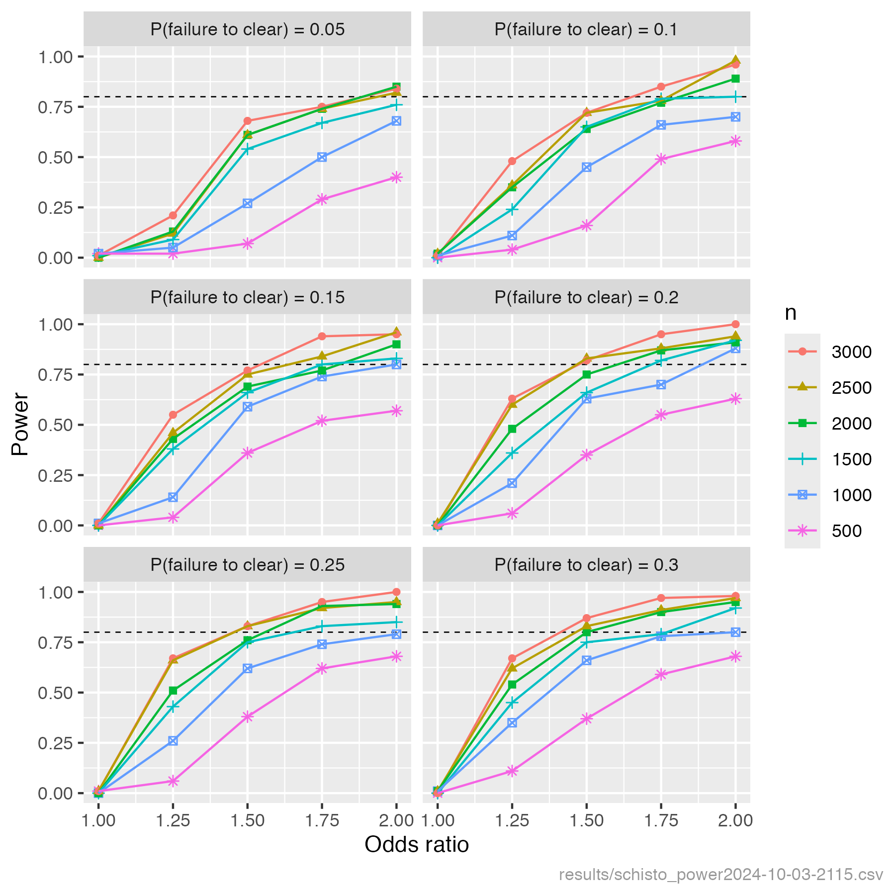

# SchistoDrivers

 ### Power analysis for identifying drivers of schistosomiasis praziquantel treatment failure

 The script PowerAnalysis.R estimates power across a range of model parameter assumptions and sample sizes, detailed in comments in the R script. Results are output as CSV to the results directory and plotted to schisto_power.png.

 The aim of the power analysis is to estimate power to detect drivers of praziquantel treatment failure in individuals infected with schistosomiasis. This is a simulation-based power analysis, where the study data is simulated and analysed multiple times under varying study design scenarios, and power is estimated as the proportion of simulated analyses that achieve the desired outcome (detecting a true driver of treatment failure). The association between the outcome (treatment failure) and each driver is estimated and tested in a multivariable GLM. For this analysis, power is defined as the proportion of drivers that are significantly associated with the outcome, averaged across 10 simulated data analyses per scenario.

 The following assumptions are made:
- 10 drivers are associated with the outcome, of which 4 are binary and 6 continuous. The prevalences of the binary drivers are: 0.2, 0.2, 0.2, 0.5, representing drivers such as co-infection (HIV, soil-transmitted helminths, malaria) and hybrid/resistance presence).
 - The drivers are correlated with each other, with a common correlation coefficient of 0.25. We don’t know what the true correlation is among drivers, but moderate correlations are likely and neglecting them will give optimistic power estimates.
 - In order to control inflation of the number of false positive results due to multiple testing of 10 drivers, the significance threshold of 0.05 is Bonferroni-adjusted to 0.005, i.e. a driver is significant if P < 0.005.

 We explore the effect on power of varying the following study design choices/assumptions:
 - Sample size (number of infected and treated individuals): 500, 1000, 1500, 2000, 2500, 3000.
 - The proportion of these that fail to clear: 0.05, 0.1, 0.15, 0.2, 0.25, 0.3.
 - The strength of association between each driver and failure to clear, defined as an odds ratio for binary drivers and as an odds ratio per standard deviation unit for continuous drivers: 1.25, 1.5, 1.75, 2. To give a sense of what these effect sizes mean:
   - If a binary driver has an odds ratio of 1.5, then if 5% of people fail to clear in the absence of a driver, that proportion will be 7.3% among those who are exposed to the driver. If the prevalence of failure to clear is 25% without the driver, it will be 33% with the driver.
   - If we raise the odds ratio from 1.5 to 2, then the prevalences of failure to clear in the exposed population will be 9.5% relative to 5% in the unexposed population, and 40% relative to 25% in the unexposed population.

 ### Results
 