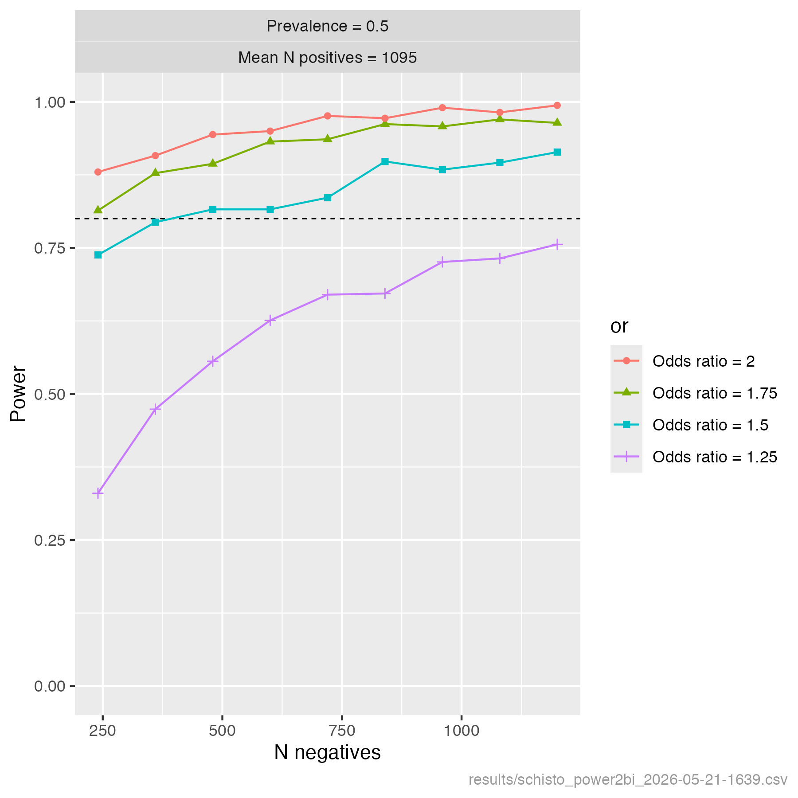
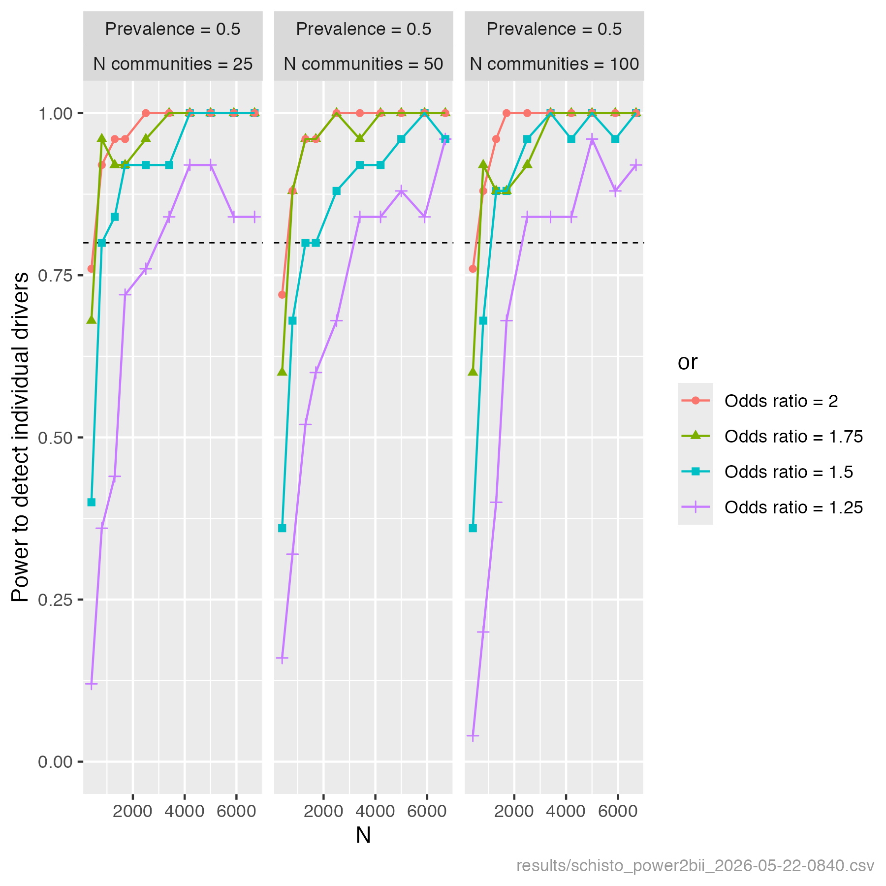
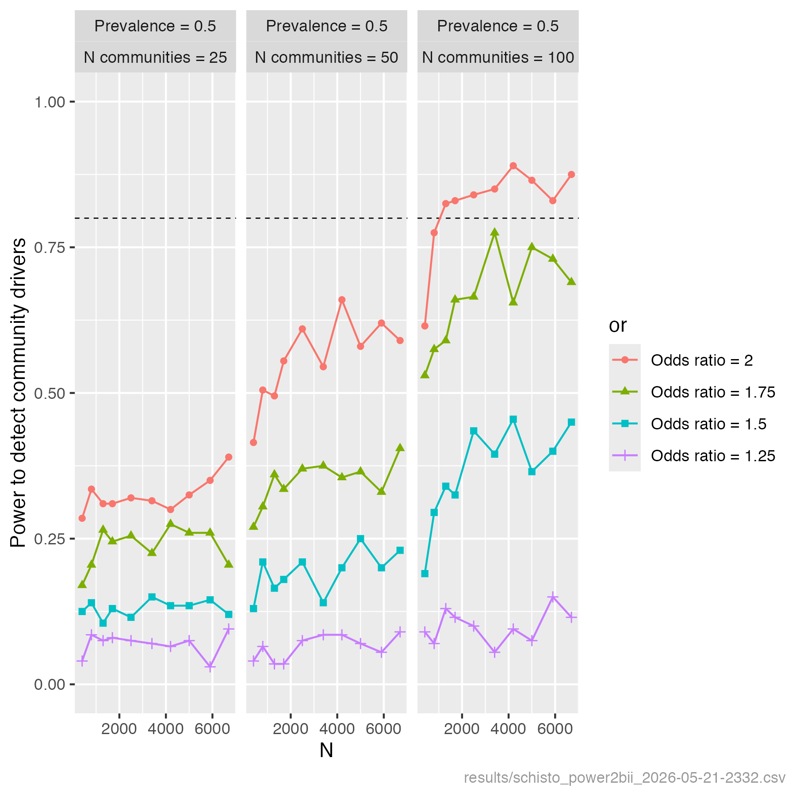
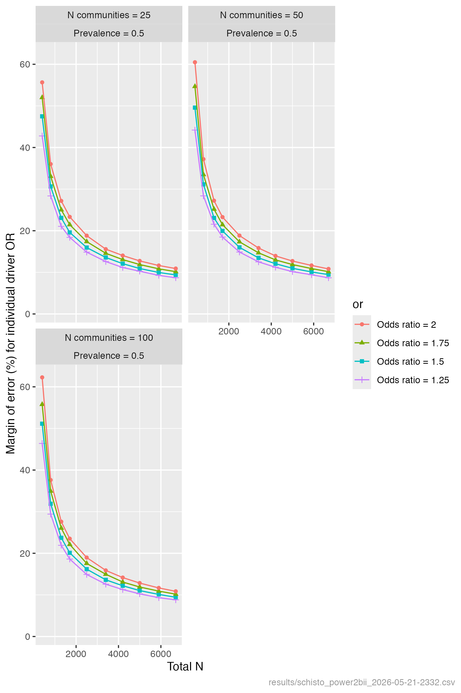
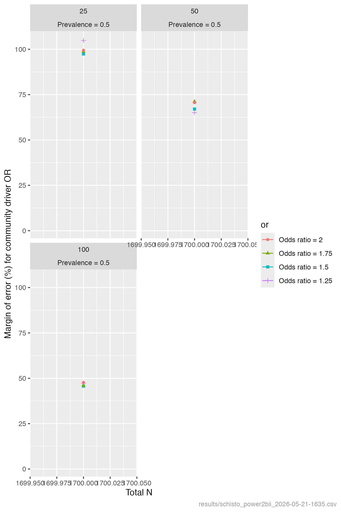
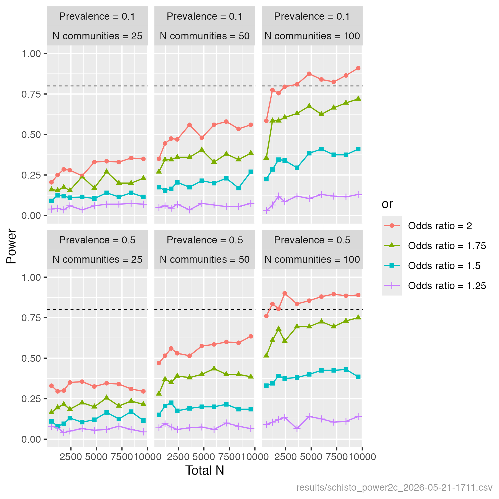
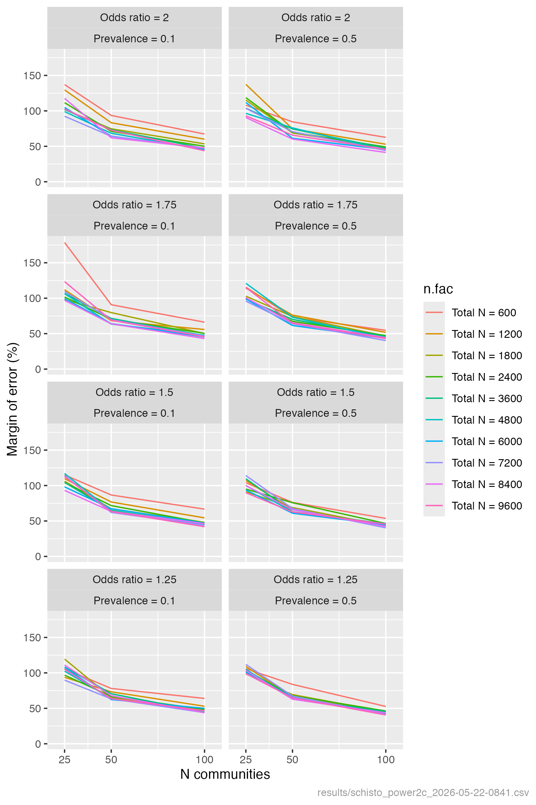

## Sample size for Aim 2b-i: identifying individual-level drivers of schistosomiasis infection

 ### Methods

 The aim of this power analysis is to estimate power to detect drivers of schistosomiasis infection. The association between the outcome (infection) and each driver is estimated and tested in a multivariable GLM. Power is defined as the proportion of drivers that are significantly associated with the outcome, averaged across 50 simulated data analyses per scenario.

 The following assumptions are made:
- 10 drivers are associated with the outcome, of which 3 are binary and 7 continuous. The prevalences of the binary drivers are: 0.5, 0.2, 0.2, representing  malaria, soil-transmitted helminths, hybrid/resistance presence .
 - The drivers are correlated with each other, with a common correlation coefficient of 0.25. We don’t know what the true correlation is among drivers, but moderate correlations are likely and neglecting them will give optimistic power estimates.
 - In order to control inflation of the number of false positive results due to multiple testing of 10 drivers, the significance threshold of 0.05 is Bonferroni-adjusted to 0.005, i.e. a driver is significant if P < 0.005.

 We explore the effect on power of varying the following study design choices/assumptions:
 - Sample size: it is assumed that approximately 1200 infected individuals will be recruited (mean realised number of positives = 1096), while the number of negatives will be varied: 240, 360, 480, 600, 720, 840, 960, 1080, 1200.
 - The strength of association between each driver and failure to clear, defined as an odds ratio for binary drivers and as an odds ratio per standard deviation unit for continuous drivers: 1.25, 1.5, 1.75, 2. Full details are provided in the script [PowerAnalysis.R](https://github.com/pcdjohnson/SchistoDrivers/blob/main/PowerAnalysis.R). Results are output as CSV to the [results](https://github.com/pcdjohnson/SchistoDrivers/tree/main/results) directory and plotted to [schisto_power2bi.png](https://github.com/pcdjohnson/SchistoDrivers/blob/main/schisto_power2bi.png).

 ### Results
  

## Sample size calculation for Aim 2b-ii: identifying individual- and community-level drivers of re-infection following clearance

 ### Methods

 The aim of this power analysis is to estimate power to detect individual- and community-level drivers of schistosomiasis re-infection following clearance, and the expected margin of error around community-level driver odds ratio estimates. The association between the outcome (infection) and each driver is estimated and tested in a multivariable GLMM. For this analysis, power is defined as the proportion of drivers that are significantly associated with the outcome, averaged across 25 simulated data analyses per scenario. Power and margin of error (i.e. 95% confidence interval) in odds ratio estimation are presented separately for individual and community-level drivers.

 The following assumptions are made:
- 5 drivers are associated with the outcome, of which 1 are binary and 4 continuous. The prevalences of the binary drivers are: 0.2, representing  hybrid/resistance presence .
 - A further 4 continuous community-level drivers are associated with the outcome.
 - The drivers are correlated with each other, with a common correlation coefficient of 0.25. We don’t know what the true correlation is among drivers, but moderate correlations are likely and neglecting them will give optimistic power estimates.
 - Log odds of re-infection varies among communities with a variance of 2.73.
 - In order to control inflation of the number of false positive results due to multiple testing of 5 individual-level drivers and 4 community-level drivers, the significance threshold of 0.05 was Bonferroni-adjusted to 0.01 and 0.0125 respectively.

 We explore the effect on power of varying the following study design choices/assumptions:
 - Total sample size: 1700.
 - Community sample size (number of communities sampled): 25, 50, 100.
 - Prevalence of re-infection: 0.5.
 - The strength of association between each driver and re-infection, defined as an odds ratio per standard deviation unit for continuous community-level drivers: 1.25, 1.5, 1.75, 2.

 Full details are provided in the script [PowerAnalysis.R](https://github.com/pcdjohnson/SchistoDrivers/blob/main/PowerAnalysis.R). Results are output as CSV to the [results](https://github.com/pcdjohnson/SchistoDrivers/tree/main/results) directory and plotted to [schisto_power2bii.i.png](https://github.com/pcdjohnson/SchistoDrivers/blob/main/schisto_power2bii.i.png), [schisto_power2bii.c.png](https://github.com/pcdjohnson/SchistoDrivers/blob/main/schisto_power2bii.c.png), [schisto_moe2bii.i.png](https://github.com/pcdjohnson/SchistoDrivers/blob/main/schisto_moe2bii.i.png) and [schisto_moe2bii.c.png](https://github.com/pcdjohnson/SchistoDrivers/blob/main/schisto_moe2bii.c.png).

 ### Results
  

  

  

  

## Sample size calculation for Aim 2c-i: identifying community-level drivers of schistosomiasis infection

 ### Methods

 The aim of this power analysis is to estimate power to detect community-level drivers of schistosomiasis infection, and the expected margin of error around community-level driver odds ratio estimates. The association between the outcome (infection) and each driver is estimated and tested in a multivariable GLMM. For this analysis, power is defined as the proportion of drivers that are significantly associated with the outcome, averaged across 25 simulated data analyses per scenario.

 The following assumptions are made:
- 4 continuous drivers are associated with the outcome.
 - The drivers are correlated with each other, with a common correlation coefficient of 0.25. We don’t know what the true correlation is among drivers, but moderate correlations are likely and neglecting them will give optimistic power estimates.
 - Log odds of infection prevalence varies among communities with a variance of 2.73.
 - In order to control inflation of the number of false positive results due to multiple testing of 4 drivers, the significance threshold of 0.05 is Bonferroni-adjusted to 0.0125, i.e. a driver is significant if P < 0.0125.

 We explore the effect on power of varying the following study design choices/assumptions:
 - Total sample size: 2400.
 - Community sample size (number communities sampled): 25, 50, 100.
 - Prevalence of infection: 0.1, 0.5.
 - The strength of association between each driver and failure to clear, defined as an odds ratio per standard deviation unit for continuous community-level drivers: 1.25, 1.5, 1.75, 2.

 Full details are provided in the script [PowerAnalysis.R](https://github.com/pcdjohnson/SchistoDrivers/blob/main/PowerAnalysis.R). Results are output as CSV to the [results](https://github.com/pcdjohnson/SchistoDrivers/tree/main/results) directory and plotted to [schisto_power2c.png](https://github.com/pcdjohnson/SchistoDrivers/blob/main/schisto_power2c.png) and [schisto_moe2c.png](https://github.com/pcdjohnson/SchistoDrivers/blob/main/schisto_moe2c.png).

 ### Results
  

  

